# PLAN DE IMPLEMENTACIÓN - TASK-012
## CRUD Completo de Clientes + Sistema de Tarifas Planas

### 🎯 OBJETIVOS
Implementar un sistema de tarifas flexible que permita:
1. Tarifas planas y por minuto personalizadas por cliente
2. Tarifas planas por zona con clientes específicos
3. CRUD completo para gestión de clientes
4. Lógica de prioridades en cálculo de tarifas

### 📋 ANÁLISIS ACTUAL

#### Estado del CRUD de Clientes:
- ✅ **CREATE**: Implementado en `POST /clients`
- ✅ **READ**: Implementado con paginación en `GET /clients`
- ❌ **UPDATE**: No implementado
- ❌ **DELETE**: No implementado (solo soft delete sugerido)

#### Estado del Sistema de Tarifas:
- ✅ Cálculo básico por zona con `price_per_minute`
- ✅ Recargos nocturnos y de fin de semana
- ❌ Tarifas planas por cliente
- ❌ Tarifas planas por zona
- ❌ Relación zona-clientes específicos

### 🏗️ ARQUITECTURA PROPUESTA

#### Modelo de Datos:

```mermaid
erDiagram
    CLIENT {
        int id PK
        string first_name
        string last_name
        string phone_number
        string email
        decimal flat_rate "Nueva - Tarifa plana VIP"
        decimal minute_rate "Nueva - Tarifa por minuto personalizada"
        boolean is_vip "Nueva - Indicador VIP"
    }
    
    ZONE {
        int id PK
        string name
        decimal price_per_minute "Existente"
        decimal flat_rate "Nueva - Tarifa plana de zona"
        boolean has_special_clients "Nueva - Tiene clientes específicos"
    }
    
    ZONE_CLIENT {
        int zone_id PK,FK
        int client_id PK,FK
        decimal special_flat_rate "Tarifa especial para este cliente en esta zona"
        boolean active
        datetime created_at
    }
    
    CLIENT ||--o{ ZONE_CLIENT : "puede estar en"
    ZONE ||--o{ ZONE_CLIENT : "puede tener"
```



#### Lógica de Prioridades para Cálculo de Tarifas:


### 🚀 FASES DE IMPLEMENTACIÓN

#### FASE 1: Actualización de Entidades y Migración
**Duración estimada:** 3-4 horas

**1.1 Actualizar Client Entity**
```typescript
// Nuevos campos en src/entities/client.entity.ts
@Column({ type: 'decimal', precision: 10, scale: 2, nullable: true })
flat_rate?: number;

@Column({ type: 'decimal', precision: 10, scale: 2, nullable: true })
minute_rate?: number;

@Column({ default: false })
is_vip: boolean;

// Nueva relación
@ManyToMany(() => Zone, zone => zone.specialClients)
@JoinTable({
  name: 'zone_clients',
  joinColumn: { name: 'client_id', referencedColumnName: 'id' },
  inverseJoinColumn: { name: 'zone_id', referencedColumnName: 'id' }
})
specialZones: Zone[];
```

**1.2 Actualizar Zone Entity**
```typescript
// Nuevos campos en src/entities/zone.entity.ts
@Column({ type: 'decimal', precision: 10, scale: 2, nullable: true })
flat_rate?: number;

@Column({ default: false })
has_special_clients: boolean;

// Nueva relación
@ManyToMany(() => Client, client => client.specialZones)
specialClients: Client[];
```

**1.3 Crear ZoneClient Entity**
```typescript
// Nueva entidad src/entities/zone-client.entity.ts
@Entity('zone_clients')
export class ZoneClient {
  @PrimaryColumn()
  zone_id: number;

  @PrimaryColumn()
  client_id: number;

  @Column({ type: 'decimal', precision: 10, scale: 2, nullable: true })
  special_flat_rate?: number;

  @Column({ default: true })
  active: boolean;

  @CreateDateColumn()
  created_at: Date;

  @ManyToOne(() => Zone)
  @JoinColumn({ name: 'zone_id' })
  zone: Zone;

  @ManyToOne(() => Client)
  @JoinColumn({ name: 'client_id' })
  client: Client;
}
```

**1.4 Crear Migración**
```bash
npm run migration:generate -- src/database/migrations/AddTariffFieldsToClientsAndZones
```

#### FASE 2: Endpoints CRUD Faltantes
**Duración estimada:** 4-5 horas

**2.1 Crear UpdateClientDto**
```typescript
// src/modules/clients/dto/update-client.dto.ts
export class UpdateClientDto {
  @IsOptional()
  @IsString()
  first_name?: string;

  @IsOptional()
  @IsString()
  last_name?: string;

  @IsOptional()
  @IsEmail()
  email?: string;

  @IsOptional()
  @IsString()
  usual_address?: string;

  @IsOptional()
  @IsDecimal({ decimal_digits: '0,2' })
  flat_rate?: number;

  @IsOptional()
  @IsDecimal({ decimal_digits: '0,2' })
  minute_rate?: number;

  @IsOptional()
  @IsBoolean()
  is_vip?: boolean;

  @IsOptional()
  @IsBoolean()
  active?: boolean;

  @IsOptional()
  @IsString()
  notes?: string;
}
```

**2.2 Implementar Métodos en ClientsService**
```typescript
// Agregar a src/modules/clients/clients.service.ts
async update(id: number, updateClientDto: UpdateClientDto): Promise<Client> {
  const client = await this.findOne(id);
  Object.assign(client, updateClientDto);
  return await this.clientsRepository.save(client);
}

async remove(id: number): Promise<void> {
  const client = await this.findOne(id);
  client.active = false;
  await this.clientsRepository.save(client);
}

async assignToZone(clientId: number, zoneId: number, specialRate?: number): Promise<void> {
  // Lógica para asignar cliente a zona con tarifa especial
}
```

**2.3 Agregar Endpoints en ClientsController**
```typescript
// Agregar a src/modules/clients/clients.controller.ts
@Put(':id')
@UseGuards(JwtAuthGuard, RolesGuard)
@Roles('admin', 'operator')
async update(@Param('id') id: number, @Body() updateClientDto: UpdateClientDto) {
  return this.clientsService.update(id, updateClientDto);
}

@Delete(':id')
@UseGuards(JwtAuthGuard, RolesGuard)
@Roles('admin')
async remove(@Param('id') id: number) {
  await this.clientsService.remove(id);
  return { message: 'Cliente desactivado exitosamente' };
}

@Post(':clientId/zones/:zoneId')
@UseGuards(JwtAuthGuard, RolesGuard)
@Roles('admin')
async assignToZone(
  @Param('clientId') clientId: number,
  @Param('zoneId') zoneId: number,
  @Body() body: { specialRate?: number }
) {
  await this.clientsService.assignToZone(clientId, zoneId, body.specialRate);
  return { message: 'Cliente asignado a zona exitosamente' };
}
```

#### FASE 3: Nueva Lógica de Cálculo de Tarifas
**Duración estimada:** 4-5 horas

**3.1 Actualizar FareService**
```typescript
// Modificar src/modules/rides/fare.service.ts
async calculateFareWithPriorities(
  clientId: number,
  originCoordinates: string,
  duration: number,
): Promise<FareCalculationResult> {
  
  // 1. Obtener cliente con sus relaciones
  const client = await this.getClientWithZones(clientId);
  
  // 2. Determinar zona
  const zone = await this.findZoneForCoordinates(originCoordinates);
  
  // 3. Aplicar lógica de prioridades
  let baseFare: number;
  let calculationType: string;
  
  if (client.flat_rate) {
    // Prioridad 1: Tarifa plana del cliente
    baseFare = client.flat_rate;
    calculationType = 'client_flat_rate';
  } else if (client.minute_rate) {
    // Prioridad 2: Tarifa por minuto del cliente
    baseFare = Math.max(duration * client.minute_rate, zone.minimum_fare);
    calculationType = 'client_minute_rate';
  } else if (await this.hasSpecialZoneRate(client.id, zone.id)) {
    // Prioridad 3: Tarifa especial zona-cliente
    const specialRate = await this.getSpecialZoneRate(client.id, zone.id);
    baseFare = specialRate;
    calculationType = 'zone_special_client_rate';
  } else if (zone.flat_rate) {
    // Prioridad 4: Tarifa plana de la zona
    baseFare = zone.flat_rate;
    calculationType = 'zone_flat_rate';
  } else {
    // Prioridad 5: Cálculo tradicional
    baseFare = Math.max(
      duration * zone.price_per_minute,
      zone.minimum_fare
    );
    calculationType = 'traditional_per_minute';
  }
  
  // 4. Aplicar recargos y comisiones
  return this.applyChargesAndCommission(baseFare, zone, calculationType);
}
```

#### FASE 4: Testing y Documentación
**Duración estimada:** 2-3 horas

**4.1 Tests Unitarios**
- Tests para nueva lógica de cálculo de tarifas
- Tests para operaciones CRUD de clientes
- Tests para relaciones zona-cliente

**4.2 Tests de Integración**
- Tests end-to-end para flujos completos
- Tests de validación de datos

**4.3 Documentación Swagger**
- Actualizar documentación de todos los endpoints
- Ejemplos de uso para nuevos campos

### 🔧 COMANDOS DE IMPLEMENTACIÓN

```bash
# 1. Crear migración
npm run migration:generate -- src/database/migrations/AddTariffFieldsToClientsAndZones

# 2. Ejecutar migración
npm run migration:run

# 3. Ejecutar tests
npm run test

# 4. Verificar compilación
npm run build
```

### ✅ CRITERIOS DE ACEPTACIÓN

#### Funcionales:
- [ ] Cliente puede tener tarifa plana personalizada
- [ ] Cliente puede tener tarifa por minuto personalizada
- [ ] Zona puede tener tarifa plana
- [ ] Zona puede tener clientes específicos con tarifas especiales
- [ ] Lógica de prioridades funciona correctamente
- [ ] CRUD completo de clientes operativo

#### Técnicos:
- [ ] Migración ejecuta sin errores
- [ ] Tests pasan al 100%
- [ ] Documentación Swagger actualizada
- [ ] Performance no degradada
- [ ] Logging adecuado implementado

#### De Negocio:
- [ ] Cálculo de tarifas es preciso
- [ ] Flexibilidad para diferentes tipos de clientes
- [ ] Compatibilidad con sistema existente
- [ ] Posibilidad de configuración dinámica

### 🚨 CONSIDERACIONES IMPORTANTES

1. **Migración de Datos:**
   - Los clientes existentes mantendrán `null` en nuevos campos
   - No afecta funcionalidad existente

2. **Performance:**
   - Nuevas consultas pueden impactar performance
   - Considerar índices en campos de tarifa

3. **Compatibilidad:**
   - Mantener backward compatibility
   - API existente sigue funcionando

4. **Seguridad:**
   - Solo admins pueden modificar tarifas
   - Validación estricta de valores monetarios

5. **Testing:**
   - Casos edge: clientes con múltiples configuraciones
   - Validación de cálculos monetarios precisos 