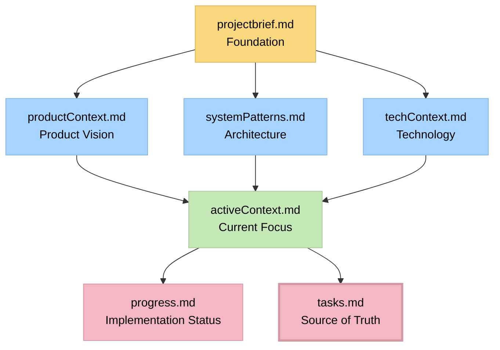

# MEMORY BANK - TAXI ROSA BACKEND

## 📚 DOCUMENTACIÓN INTEGRAL DEL PROYECTO

Este directorio contiene la **memoria completa** del proyecto Taxi Rosa Backend, implementando el sistema **ADAPTIVE MEMORY-BASED ASSISTANT** para mantener contexto y continuidad a lo largo del desarrollo.

## 🗂️ ESTRUCTURA DE ARCHIVOS

### 📋 Archivos Principales

| Archivo | Propósito | Estado |
|---------|-----------|--------|
| `projectbrief.md` | **Foundation** - Información base del proyecto | ✅ Completo |
| `productContext.md` | **Product Vision** - Contexto del producto y usuarios | ✅ Completo |
| `systemPatterns.md` | **Architecture** - Patrones técnicos y arquitectura | ✅ Completo |
| `techContext.md` | **Technology** - Stack tecnológico y configuraciones | ✅ Completo |
| `activeContext.md` | **Current Focus** - Estado actual del desarrollo | ✅ Actualizado |
| `progress.md` | **Implementation Status** - Historial de implementaciones | ✅ Completo |
| `tasks.md` | **Source of Truth** - Backlog y gestión de tareas | ✅ Activo |

## 🎯 SISTEMA DE MEMORY BANK

### Flujo de Información


### Responsabilidades por Archivo

#### 📌 projectbrief.md
- **Qué:** Información fundamental e inmutable del proyecto
- **Cuándo usar:** Para entender objetivos, stakeholders y arquitectura base
- **Actualización:** Raramente (solo cambios estructurales mayores)

#### 🎯 productContext.md  
- **Qué:** Visión del producto, propuesta de valor y experiencia de usuario
- **Cuándo usar:** Para entender el "por qué" detrás de las funcionalidades
- **Actualización:** Cuando cambian requerimientos de negocio

#### 🏗️ systemPatterns.md
- **Qué:** Patrones arquitectónicos, decisiones técnicas y estándares
- **Cuándo usar:** Para mantener consistencia en implementación
- **Actualización:** Cuando se adoptan nuevos patrones

#### 🔧 techContext.md
- **Qué:** Stack tecnológico, configuraciones y setup técnico
- **Cuándo usar:** Para setup, deployment o troubleshooting técnico
- **Actualización:** Cuando cambian tecnologías o configuraciones

#### 🔄 activeContext.md
- **Qué:** Estado actual del desarrollo y próximos pasos
- **Cuándo usar:** Para entender el contexto inmediato de trabajo
- **Actualización:** Frecuentemente (cada sesión de desarrollo)

#### 📈 progress.md
- **Qué:** Historial cronológico de implementaciones y hitos
- **Cuándo usar:** Para tracking de progreso y lecciones aprendidas
- **Actualización:** Al completar fases o hitos importantes

#### 📋 tasks.md
- **Qué:** **FUENTE ÚNICA DE VERDAD** para gestión de tareas
- **Cuándo usar:** Para planning, tracking y priorización
- **Actualización:** Diariamente (es el archivo más dinámico)

## 🔄 FLUJO DE TRABAJO CON MEMORY BANK

### 1. Al Iniciar una Sesión de Desarrollo
```bash
# Leer en este orden:
1. activeContext.md     # ¿Dónde estamos?
2. tasks.md            # ¿Qué hay que hacer?
3. progress.md         # ¿Qué se ha completado?
```

### 2. Durante el Desarrollo
```bash
# Consultar según necesidad:
- systemPatterns.md    # Para decisiones técnicas
- techContext.md       # Para configuraciones
- productContext.md    # Para validar funcionalidades
```

### 3. Al Finalizar una Sesión
```bash
# Actualizar:
1. tasks.md           # Estado de tareas (CRÍTICO)
2. activeContext.md   # Contexto actual
3. progress.md        # Si se completó algo importante
```

## 📊 MÉTRICAS DEL MEMORY BANK

### Estado Actual del Proyecto
- **Documentación:** 100% completa
- **Cobertura de contexto:** Total
- **Actualización:** Al día (2025-01-25)
- **Consistencia:** Validada entre archivos

### Información Clave Rápida
- **Fase actual:** Trip Management (Fase 6)
- **Tareas activas:** 2 de alta prioridad
- **Próximo hito:** Optimización y testing
- **Estado general:** ✅ En buen estado

## 🎯 CÓMO USAR ESTE SISTEMA

### Para Desarrolladores
1. **Siempre empezar** leyendo `activeContext.md` y `tasks.md`
2. **Consultar referencias** según necesidad específica
3. **Actualizar estado** al terminar cada sesión
4. **Mantener consistencia** entre archivos

### Para Product Managers
1. **productContext.md** para visión del producto
2. **progress.md** para tracking de hitos
3. **tasks.md** para planning y priorización

### Para Technical Leads
1. **systemPatterns.md** para arquitectura
2. **techContext.md** para decisiones técnicas
3. **activeContext.md** para estado técnico

## 🔧 MANTENIMIENTO DEL MEMORY BANK

### Reglas de Oro
1. **tasks.md es la fuente única de verdad** para gestión
2. **activeContext.md debe actualizarse** cada sesión
3. **Consistencia entre archivos** es crítica
4. **Información histórica** en progress.md no se modifica
5. **Cambios estructurales** solo en projectbrief.md

### Validaciones Periódicas
- [ ] Coherencia entre archivos
- [ ] Actualidad de información técnica
- [ ] Completitud de documentación
- [ ] Alineación con estado real del código

## 📞 CONTACTO Y SOPORTE

Para cualquier duda sobre el uso del Memory Bank:
- **Documentación base:** `projectbrief.md`
- **Estado actual:** `activeContext.md`
- **Tareas:** `tasks.md`
- **Información técnica:** `techContext.md`

---

**Memory Bank creado:** 2025-01-25  
**Última actualización:** 2025-01-25  
**Versión:** 1.0.0  
**Estado:** ✅ Operativo y completo 